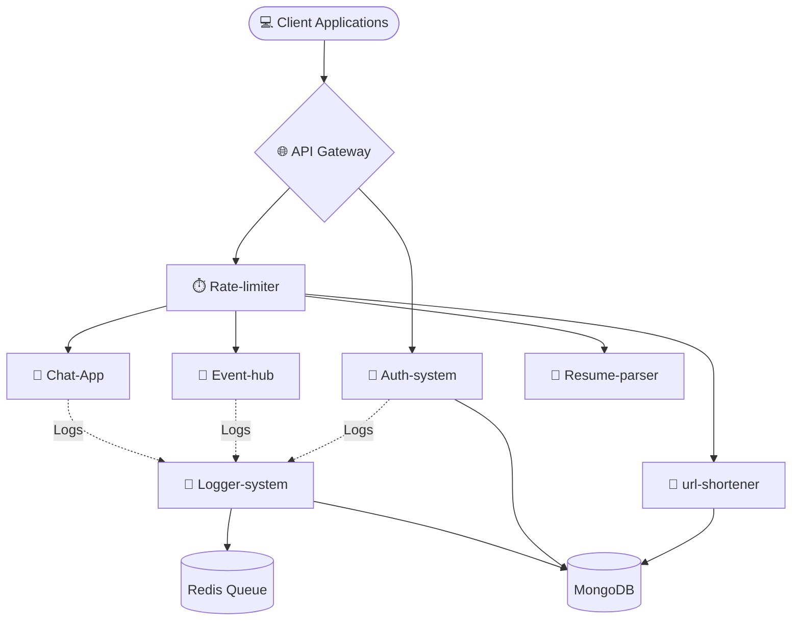

#  Backend Practice Repository


Welcome to my **Backend Practice Monorepo**! 🌟 This repository contains a variety of backend projects, microservices, and experiments designed to practice modern backend development, system design, and software architecture.

---

##  Overview Architecture

Here is a conceptual look at how these different microservices and concepts could interact in a real-world ecosystem:



---

## 📂 Repository Structure

```text
📦 Backend-Practice
 ├── 🔐 Auth-system      # JWT-based Authentication API
 ├── 💬 Chat-App         # Real-time WebSocket Chat Application
 ├── 🎫 Event-hub        # Event Management System (Client + Server)
 ├── 📜 Logger-system    # Redis + BullMQ Asynchronous Logging Service
 ├── ⏱️ Rate-limiter     # API Rate Limiting Middleware
 ├── 📄 Resume-parser    # PDF Upload & Text Parsing Service
 └── 🔗 url-shortener    # URL Shortening & Redirect Service
```

---

##  Mini-Projects Explained

### 1.  Auth-system
A robust authentication and authorization server. 
- **Tech Stack:** Node.js, Express, Mongoose, `bcrypt`, `jsonwebtoken`.
- **Features:** User registration, secure password hashing, JWT token generation for session management, and protected API routes.

### 2.  Chat-App
A real-time communication application.
- **Tech Stack:** React (Client), Node.js (Server), Socket.io (WebSockets).
- **Features:** Real-time messaging, user presence detection, and instant state updates without HTTP polling.

### 3.  Event-hub
An event management application spanning full-stack development.
- **Tech Stack:** React (Client), Node.js (Server).
- **Features:** Creating events, managing attendees, and handling standard event lifecycle operations.

### 4.  Logger-system
A high-performance, asynchronous logging service using message queues. By decoupling logging from the main application thread, it ensures high performance.
- **Tech Stack:** Node.js, Express, `ioredis`, `bullmq`, MongoDB.
- **How it works:** 
  ```mermaid
  sequenceDiagram
      participant App as Other Services
      participant Queue as Redis (BullMQ)
      participant Worker as Logger Worker
      participant DB as MongoDB
      App->>Queue: Push Log Event
      Queue->>Worker: Process Background Job
      Worker->>DB: Save Log Entry
  ```

### 5.  Rate-limiter
A protective middleware service designed to prevent API abuse, brute-force attacks, and DDoS attempts.
- **Tech Stack:** Node.js, Express.
- **Features:** Tracks client IP addresses and restricts the number of allowed HTTP requests within a configured time window.

### 6.  Resume-parser
A utility service for handling file uploads and extracting text from PDFs.
- **Tech Stack:** Node.js, Express, `multer`, `pdf-parse`.
- **Features:** Securely accepts `.pdf` resume uploads, parses the binary data, and extracts readable text for further analysis or indexing.

### 7.  url-shortener
A service similar to Bitly that converts long, unwieldy URLs into compact, shareable identifiers.
- **Tech Stack:** Node.js, Express, MongoDB, `nanoid`.
- **How it works:**
  ```mermaid
  graph LR
      LongURL[https://very-long-url.com/article] --> Hash[Generate nanoid: 'XyZ12']
      Hash --> DB[(Save to MongoDB)]
      User[User visits /XyZ12] --> Lookup[DB Lookup]
      Lookup --> Redirect[HTTP 301 Redirect to LongURL]
  ```

---

## 🚀 Getting Started

Each project is self-contained. To run any specific service locally:

1. **Navigate to the project directory:**
   ```bash
   cd Chat-App/server
   ```
2. **Install dependencies:**
   ```bash
   npm install
   ```
3. **Environment Setup:** Ensure you create a `.env` file for services that require MongoDB URIs, JWT Secrets, or Redis connection strings.
4. **Run the development server:**
   ```bash
   npm run dev
   ```

